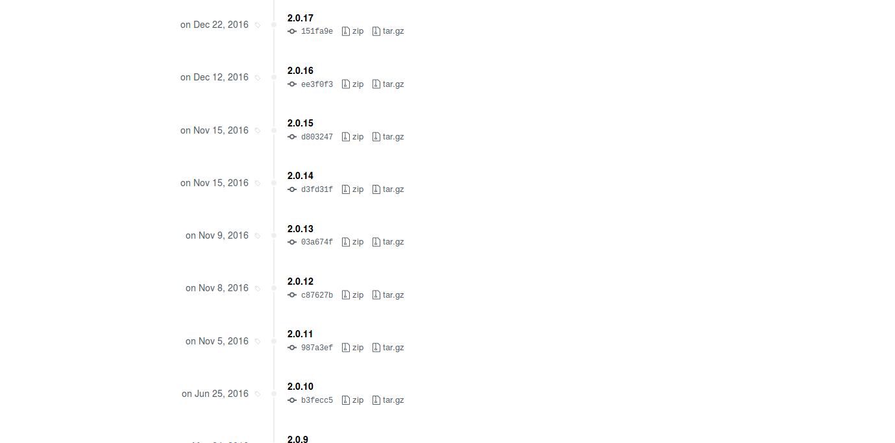
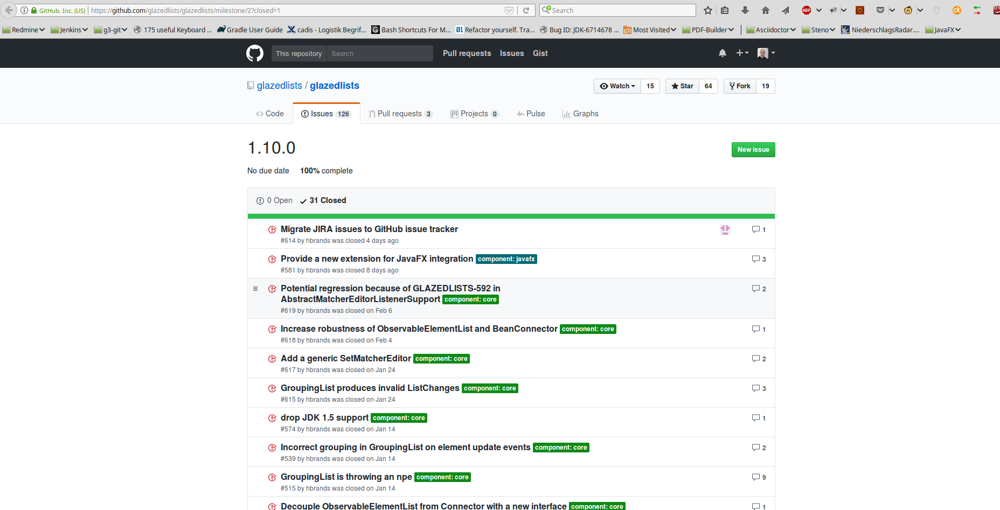
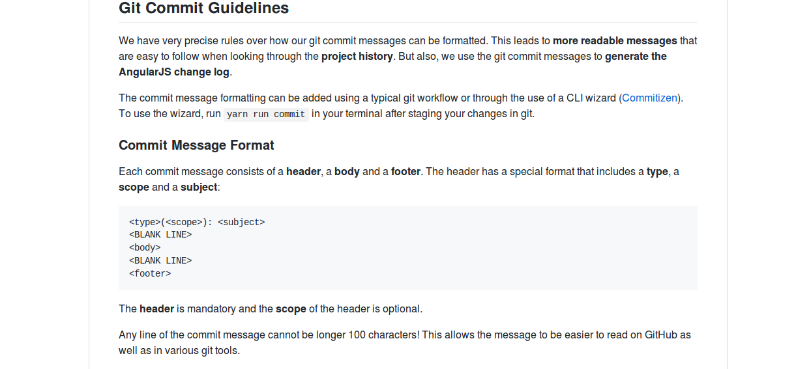
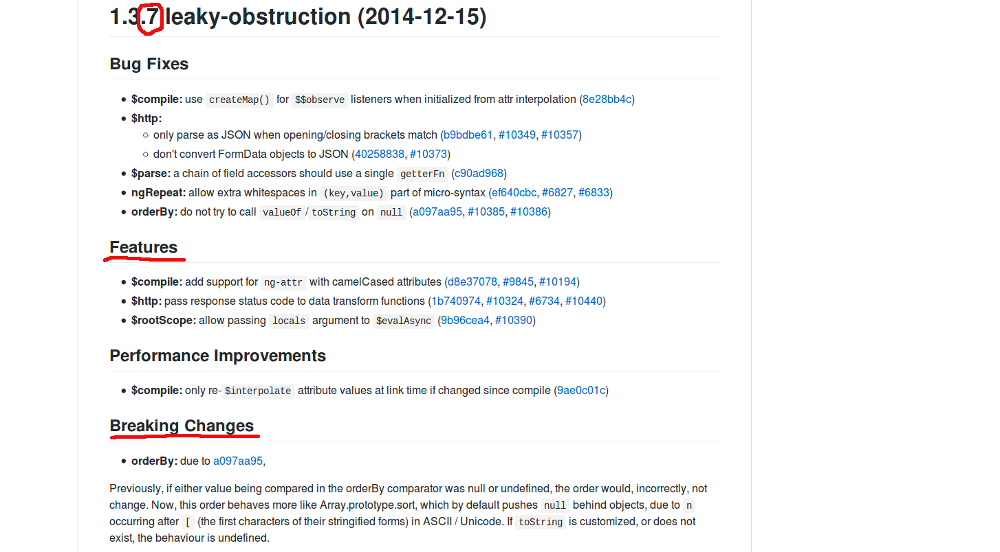
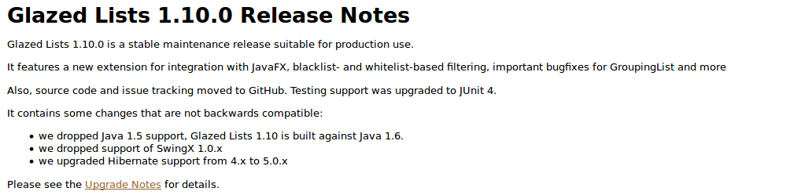
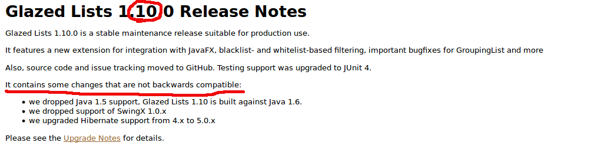
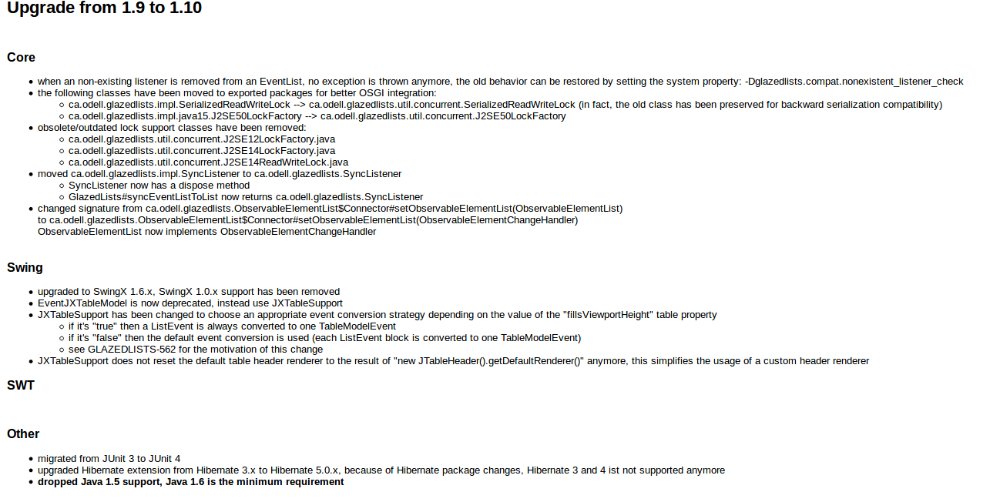
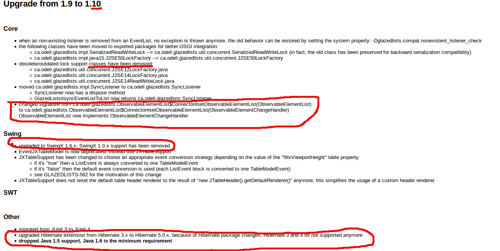
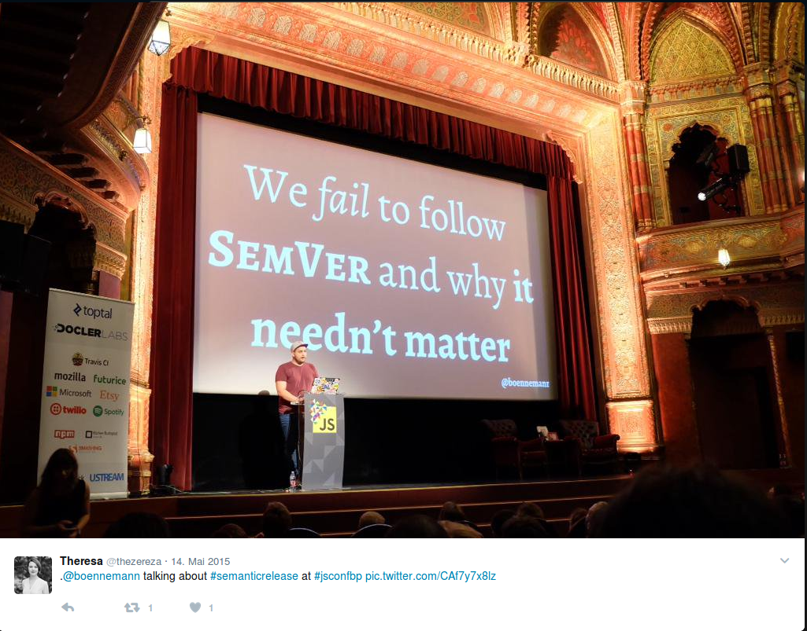

:down-double-arrow: &#8659;

== Who am I?

* Java developer since 2001
* Team Lead at https://www.kratzer-automation.com/[Kratzer Automation AG]
* icon:twitter[] http://twitter.com/tobias_schulte[@tobias_schulte]
* icon:envelope[] tobias.schulte@gliderpilot.de
* icon:github[] https://github.com/tschulte

== The workflows

=== Version in buildfile(s)

Developer triggers CI (optional parameters)

[cols="1a,1a"]
|===
|
* Build (check if it's working)
* Remove "-SNAPSHOT"
* Commit and push
* Create and push tag
* Increase Version, append SNAPSHOT
|
* Commit/Push
* Checkout tag
* Build version
* Publish artefacts
* Checkout branch head
|===

=== => Maven Release Plugin and some Gradle Plugins

=== Version in VCS

Developer triggers CI (optional parameters)

* Build version
* Create and push tag
* Publish artefacts

=== => the other Gradle Plugins

== But first

[.important]
What's the new version?

=== Versioning Schemes

* ${major}
* ${major}.${minor}
* ${major}.${minor}.${patch}
* ${major}.${minor}.${patch}.${qualifier}
* ${major}.${minor}.${patch}-RCx
* ${major}.${minor}.${patch}-FINAL
* TeX
* Windows
* https://en.wikipedia.org/wiki/Software_versioning[...]

== http://semver.org/[SemVer] anyone?

=== MAJOR.MINOR.PATCH

=== Patch

[quote, SemVer-specification]
Patch version Z (x.y.Z | x > 0) MUST be incremented if only backwards compatible bug fixes are introduced. A bug fix is defined as an internal change that fixes incorrect behavior.

=== Minor

[quote, SemVer-specification]
Minor version Y (x.Y.z | x > 0) MUST be incremented if new, backwards compatible functionality is introduced to the public API.

=== Minor

[quote, SemVer-specification]
It MUST be incremented if any public API functionality is marked as deprecated.

=== Minor

[quote, SemVer-specification]
It MAY be incremented if substantial new functionality or improvements are introduced within the private code. It MAY include patch level changes. Patch version MUST be reset to 0 when minor version is incremented.

=== Major

[quote, SemVer-specification]
Major version X (X.y.z | X > 0) MUST be incremented if any backwards incompatible changes are introduced to the public API. It MAY include minor and patch level changes. Patch and minor version MUST be reset to 0 when major version is incremented.

[%notitle]
=== BREAKING.FEATURE.PATCH

[.important]
--
+++<del>MAJOR</del>.<del>MINOR</del>.PATCH+++

{down-double-arrow}

BREAKING.FEATURE.PATCH
--

=== 0.x Versions?

[quote, SemVer-specification]
Major version zero (0.y.z) is for initial development. Anything may change at any time. The public API should not be considered stable.

== Release notes anyone

=== Use Bugtracker

=== Use Commit message conventions ...

=== ... to generate ...

image::images/angular-commit-message-convention-annotated.png[]

=== ... the release notes

image::images/breaking-patch-version.png[]

== Breaking changes sneaking in

image::images/breaking-patch-version.png[]

=== Breaking changes sneaking in

=== Breaking changes sneaking in

=== Breaking changes sneaking in

=== Breaking changes sneaking in

=== Breaking changes sneaking in

== https://github.com/semantic-release/semantic-release[Semantic Release]

=== Haupt&shy;versions&shy;nummern&shy;erhöhungs&shy;angst

== Demo

video::images/demo.mp4[]

== How does it work

[%step]
* Version is inferred using the last tag (if any) and the commit messages
* Only creates new version if any feature or fix commit
* No tag yet => v1.0.0
* Only fixes => increment PATCH
* Any features => increment +++<del>MINOR</del>+++ FEATURE
* Any breaking features => increment +++<del>MAJOR</del>+++ BREAKING

== Default Branches

[%step]
* master
* release/1.2.x
* release/1.x

== Remember this?

Developer triggers CI (optional parameters)

* Build version
* Create and push tag
* Publish artefacts

=== Becomes

Developer pushes to master

* Build version
* Create and push tag
* Publish artefacts

== Possible workflows

[%step]
* Work on master => every push triggers new version
* Git-Flow, GitHub-Flow, etc. => merge to master (or release/1.x) triggers new version
* (RCx-versions)
